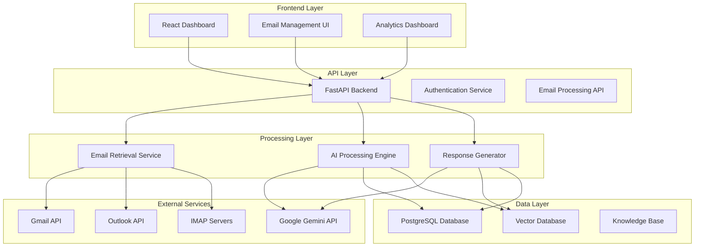

# AI-Powered Communication Assistant - Design Document

## Overview

The AI-Powered Communication Assistant is a full-stack application that automates email support workflows through intelligent processing, categorization, and response generation. The system consists of a Python backend using FastAPI for API services, a React frontend for the dashboard, and various AI/ML components for email processing. The application uses uv as the Python package manager for dependency management and virtual environment handling.

## Architecture

### High-Level Architecture



### Technology Stack

**Backend:**
- Python 3.11+ with uv package manager
- FastAPI for REST API
- SQLAlchemy for ORM
- Alembic for database migrations
- Celery for background task processing
- Redis for caching and task queue

**Frontend:**
- React 18 with TypeScript
- Vite for build tooling
- Tailwind CSS for styling
- Chart.js for analytics visualization
- React Query for state management

**AI/ML Components:**
- Google Gemini 2.5 Flash for response generation
- Sentence Transformers for embeddings
- ChromaDB for vector storage
- Transformers library for sentiment analysis

**Database:**
- PostgreSQL for primary data storage
- Redis for caching and sessions

## Components and Interfaces

### Backend Components

#### 1. Email Retrieval Service (`email_retrieval/`)
```python
class EmailRetrievalService:
    async def fetch_emails(self, provider: EmailProvider) -> List[Email]
    async def filter_support_emails(self, emails: List[Email]) -> List[Email]
    async def extract_email_metadata(self, email: Email) -> EmailMetadata
```

**Responsibilities:**
- Connect to email providers (Gmail, Outlook, IMAP)
- Filter emails based on support keywords
- Extract email metadata and content
- Handle authentication and rate limiting

#### 2. AI Processing Engine (`ai_processing/`)
```python
class AIProcessingEngine:
    async def analyze_sentiment(self, content: str) -> SentimentResult
    async def determine_priority(self, email: Email) -> PriorityLevel
    async def extract_information(self, email: Email) -> ExtractedInfo
    async def categorize_email(self, email: Email) -> EmailCategory
```

**Responsibilities:**
- Perform sentiment analysis using transformer models
- Determine email priority based on keywords and context
- Extract contact details, requirements, and metadata
- Categorize emails for better organization

#### 3. Response Generator (`response_generation/`)
```python
class ResponseGenerator:
    async def generate_response(self, email: Email, context: KnowledgeContext) -> Response
    async def retrieve_knowledge(self, query: str) -> List[KnowledgeItem]
    async def apply_rag_pipeline(self, email: Email) -> str
```

**Responsibilities:**
- Generate contextual responses using RAG pipeline
- Query knowledge base for relevant information
- Apply prompt engineering for professional tone
- Handle empathetic responses for frustrated customers

#### 4. Database Models (`models/`)
```python
class Email(Base):
    id: UUID
    sender_email: str
    subject: str
    body: str
    received_at: datetime
    sentiment: SentimentType
    priority: PriorityLevel
    status: EmailStatus
    extracted_info: JSON

class Response(Base):
    id: UUID
    email_id: UUID
    generated_content: str
    edited_content: str
    sent_at: datetime
    status: ResponseStatus
```

### Frontend Components

#### 1. Dashboard Layout (`components/Dashboard/`)
- Main dashboard container
- Navigation and routing
- Real-time updates via WebSocket

#### 2. Email List Component (`components/EmailList/`)
- Displays filtered emails with priority sorting
- Shows extracted metadata and sentiment
- Provides quick actions for responses

#### 3. Analytics Dashboard (`components/Analytics/`)
- Email volume charts
- Sentiment distribution
- Priority breakdown
- Performance metrics

#### 4. Response Editor (`components/ResponseEditor/`)
- AI-generated response display
- Rich text editor for modifications
- Send/save functionality

## Data Models

### Core Entities

```sql
-- Emails table
CREATE TABLE emails (
    id UUID PRIMARY KEY,
    sender_email VARCHAR(255) NOT NULL,
    subject TEXT NOT NULL,
    body TEXT NOT NULL,
    received_at TIMESTAMP NOT NULL,
    sentiment VARCHAR(20) NOT NULL,
    priority VARCHAR(20) NOT NULL,
    status VARCHAR(20) NOT NULL DEFAULT 'pending',
    extracted_info JSONB,
    created_at TIMESTAMP DEFAULT NOW(),
    updated_at TIMESTAMP DEFAULT NOW()
);

-- Responses table
CREATE TABLE responses (
    id UUID PRIMARY KEY,
    email_id UUID REFERENCES emails(id),
    generated_content TEXT NOT NULL,
    edited_content TEXT,
    sent_at TIMESTAMP,
    status VARCHAR(20) NOT NULL DEFAULT 'draft',
    created_at TIMESTAMP DEFAULT NOW(),
    updated_at TIMESTAMP DEFAULT NOW()
);

-- Knowledge base table
CREATE TABLE knowledge_items (
    id UUID PRIMARY KEY,
    title VARCHAR(255) NOT NULL,
    content TEXT NOT NULL,
    category VARCHAR(100),
    tags TEXT[],
    embedding VECTOR(1536),
    created_at TIMESTAMP DEFAULT NOW()
);

-- Email providers configuration
CREATE TABLE email_providers (
    id UUID PRIMARY KEY,
    provider_type VARCHAR(50) NOT NULL,
    configuration JSONB NOT NULL,
    is_active BOOLEAN DEFAULT true,
    created_at TIMESTAMP DEFAULT NOW()
);
```

### Data Flow

1. **Email Ingestion:** Emails retrieved from providers → stored in `emails` table
2. **AI Processing:** Email content → sentiment analysis → priority determination → metadata extraction
3. **Response Generation:** Email + knowledge base → RAG pipeline → generated response stored in `responses` table
4. **Dashboard Display:** Processed emails with metadata → frontend components → user interaction

## Error Handling

### Email Retrieval Errors
- **Connection Failures:** Retry with exponential backoff, fallback to cached data
- **Authentication Errors:** Refresh tokens automatically, notify admin if persistent
- **Rate Limiting:** Implement request queuing and respect provider limits

### AI Processing Errors
- **Gemini API Failures:** Implement retry logic with exponential backoff
- **Model Errors:** Log errors, use default classifications
- **Timeout Handling:** Set reasonable timeouts, queue for retry
- **Rate Limiting:** Handle Gemini API rate limits with proper queuing

### Database Errors
- **Connection Issues:** Connection pooling with automatic reconnection
- **Transaction Failures:** Rollback and retry with exponential backoff
- **Data Integrity:** Validation at application and database levels

### Frontend Error Handling
- **API Failures:** Show user-friendly error messages, retry mechanisms
- **Network Issues:** Offline mode with cached data
- **Validation Errors:** Real-time form validation with clear feedback

## Testing Strategy

### Backend Testing

#### Unit Tests
- Email retrieval service functions
- AI processing algorithms
- Response generation logic
- Database operations

#### Integration Tests
- Email provider API integrations
- Database transactions
- AI model integrations
- End-to-end email processing pipeline

#### Performance Tests
- Email processing throughput
- Response generation latency
- Database query performance
- Concurrent user handling

### Frontend Testing

#### Component Tests
- Individual React component functionality
- User interaction handling
- State management

#### Integration Tests
- API integration
- Real-time updates
- Navigation and routing

#### End-to-End Tests
- Complete user workflows
- Email processing visualization
- Response editing and sending

### AI/ML Testing

#### Model Performance Tests
- Sentiment analysis accuracy
- Priority classification precision
- Response quality evaluation
- Knowledge retrieval relevance

#### Data Quality Tests
- Email parsing accuracy
- Information extraction validation
- Response coherence checks

### Deployment Testing

#### Environment Tests
- Development, staging, production parity
- Configuration management
- Environment variable validation

#### Performance Tests
- Load testing with realistic email volumes
- Stress testing for peak usage
- Memory and CPU usage monitoring

### Testing Tools and Frameworks

**Backend:**
- pytest for unit and integration tests
- pytest-asyncio for async testing
- factory_boy for test data generation
- httpx for API testing

**Frontend:**
- Jest for unit tests
- React Testing Library for component tests
- Cypress for end-to-end tests
- MSW for API mocking

**AI/ML:**
- Custom evaluation scripts for model performance
- Benchmark datasets for sentiment analysis
- Response quality metrics (BLEU, ROUGE)

**Performance:**
- Locust for load testing
- pytest-benchmark for performance regression testing
- Memory profiling with memory_profiler